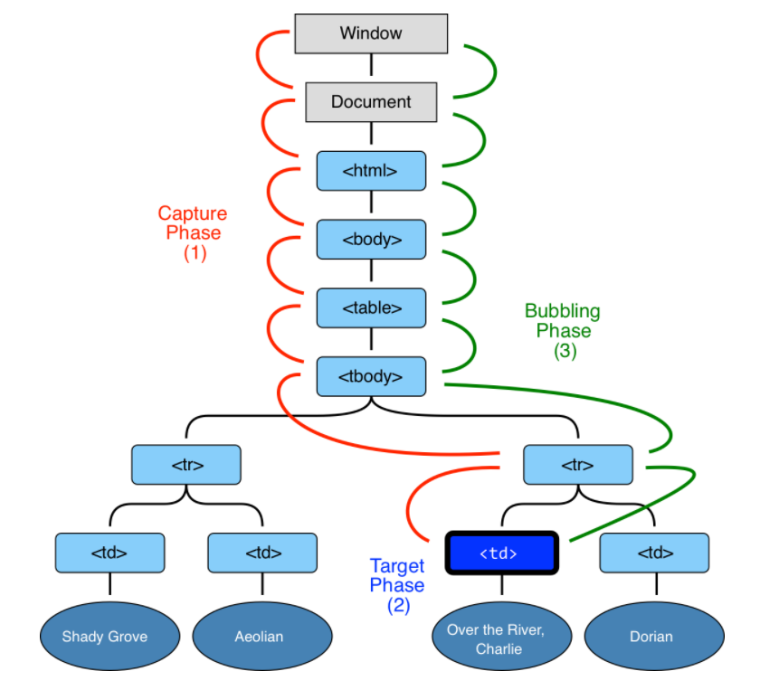

事件冒泡及事件捕获
---
``事件冒泡(event bubbling)``和``事件捕获(event capturing)``分别由微软和网景公司提出，它们是DOM事件传播的两种方式。

#### 事件冒泡(event bubbling)

微软提出了名为事件冒泡(event bubbling)的事件流。事件冒泡可以形象地比喻为把一颗石头投入水中，泡泡会一直从水底冒出水面。也就是说，事件会从最内层的元素开始发生，一直向上传播，直到document对象。

[Jsbin](https://jsbin.com/hodahen/edit?html,css,js,console,output)

~~~html
<form onclick="alert('form')">FORM
  
DIV
    
P

  

</form>
~~~

因此在事件冒泡的概念下在p元素上发生click事件的顺序应该是`p -> div -> form -> body -> html -> document`(form元素后无handler被触发).

>绝大多数事件流都采用事件冒泡！

#### `event.target`

触发事件的内嵌最深的元素称目标节点(target element)，可以有`event.target`获取。

#### 阻止冒泡

冒泡事件由目标元素一路触发至`document`甚至窗口，但有时候处理器会决定事件冒泡到某特定元素并停止冒泡。

阻止冒泡的方法就是`event.stopPropagation()`。

我们复用上面的例子来展示一下：
~~~html
<form onclick="alert('form')">FORM
  
DIV
    
P

  

</form>
~~~
此时 form 元素则不会被处发。

---

#### 事件捕获(event capturing)

网景提出另一种事件流名为事件捕获(event capturing)。与事件冒泡相反，事件会从最外层开始发生，直到最具体的元素。

DOM事件传播有三个阶段：
* 第一阶段：从window对象传导到目标节点，称为“捕获阶段”（capture phase）。

* 第二阶段：在目标节点上触发，称为“目标阶段”（target phase）。

* 第三阶段：从目标节点传导回window对象，称为“冒泡阶段”（bubbling phase）。

下图是例子，目标节点是表格里的一个<td>元素：

`addEventListener`有三个参数：

`element.addEventListener(event, function, useCapture)`

第三个参数默认值是false，表示在事件冒泡阶段调用事件处理函数;如果参数为true，则表示在事件捕获阶段调用处理函数。

[Jsbin](https://jsbin.com/xalumav/edit?html,css,console,output)
~~~html

<form>FORM
  
DIV
    
P

  

</form>

~~~

当单击P元素时，output如下：
~~~
"Capturing: HTML"
"Capturing: BODY"
"Capturing: FORM"
"Capturing: DIV"
"Capturing: P"
"Bubbling: P"
"Bubbling: DIV"
"Bubbling: FORM"
"Bubbling: BODY"
"Bubbling: HTML"
~~~

1. `HTML → BODY → FORM → DIV → P` 捕获阶段；
2. `P → DIV → FORM → BODY → HTML` 冒泡阶段;

>注意 p 元素触发了两次，分别在捕获阶段的末端和冒泡阶段的开始阶段。

---
参考：
>https://segmentfault.com/a/1190000005654451#articleHeader1

>https://javascript.info/bubbling-and-capturing
