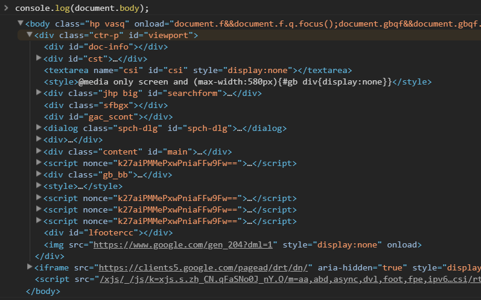

console.log()
---

用于向web控制台输出一条消息.

#### 语法
~~~
`console.log(obj1 [, obj2, ..., objN);`

`console.log(msg [, subst1, ..., substN);`

`console.log('String: %s, Int: %d,Float: %f, Object: %o', str, ints, floats, obj);`

`console.log(`temp的值为: ${temp}`);`
~~~

#### 参数
`obj1 ... objN`

一个用于输出的JavaScript对象列表. 其中每个对象会以字符串的形式按照顺序依次输出到控制台.

`msg`

一个JavaScript字符串,其中包含零个或多个替代字符串.

`subst1 ... substN`

JavaScript对象,用来依次替换msg中的替代字符串.你可以在替代字符串中指定对象的输出格式.

`str, ints, floats, obj`

类型为String, Int, Float, Object的参数

`temp`

temp为要打印的参数; 注意，第四种打印方法用的是 ` 而不是 '

---

console.log方法用于在console窗口输出信息。它可以接受多个参数，将它们的结果连接起来输出。
~~~js
console.log("Hello World")
// Hello World
~~~
~~~js
console.log("a","b","c")
// a b c
~~~
console.log方法会自动在每次输出的结尾，添加换行符。
~~~js
console.log(1);
console.log(2);
console.log(3);
// 1
// 2
// 3
~~~

如果第一个参数是格式字符串（使用了格式占位符），console.log方法将依次用后面的参数替换占位符，然后再进行输出。
~~~js
console.log(' %s + %s = %s', 1, 1, 2)
//  1 + 1 = 2
~~~
上面代码中，console.log方法的第一个参数有三个占位符（%s），第二、三、四个参数会在显示时，依次替换掉这个三个占位符。console.log方法支持的占位符格式有以下一些，不同格式的数据必须使用对应格式的占位符。
~~~
%s 字符串
%d 整数
%i 整数
%f 浮点数
%o 对象的链接
%c CSS格式字符串
~~~
~~~js
var number = 11 * 9;
var color = 'red';
console.log('%d %s balloons', number, color);
// 99 red balloons
~~~
上面代码中，第二个参数是数值，对应的占位符是%d，第三个参数是字符串，对应的占位符是%s。

使用%c占位符时，对应的参数必须是CSS语句，用来对输出内容进行CSS渲染。
~~~js
console.log('%cThis text is styled!',
  'color: red; background: yellow; font-size: 24px;'
)
~~~
上面代码运行后，输出的内容将显示为黄底红字。

console.log方法的两种参数格式，可以结合在一起使用。
~~~js
console.log(' %s + %s ', 1, 1, '= 2')
// 1 + 1  = 2
~~~
如果参数是一个对象，console.log会显示该对象的值。
~~~js
console.log({foo: 'bar'})
// {foo: "bar"}
~~~
~~~js
console.log(Date)
// ƒ Date() { [native code] }
~~~
上面代码输出Date对象的值，结果为一个构造函数。

[文本输出更多细节](https://developer.mozilla.org/en-US/docs/Web/API/console#Outputting_text_to_the_console)

#### 与console.dir()的区别

以谷歌网站为例，`console.log(document.body).console.dir(document.body)`

Notice:

* `console.log` 该元素以html树形式输出；
* `console.dir` 该元素以Json树形式输出；

上面显示dir方法的输出结果，比log方法更易读，信息也更丰富。

该方法对于输出DOM对象非常有用，因为会显示DOM对象的所有属性。

---

参考：
>https://developer.mozilla.org/zh-CN/docs/Web/API/Console/log
