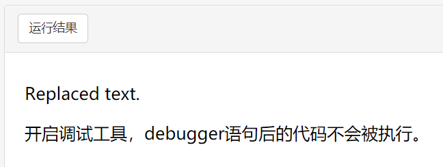
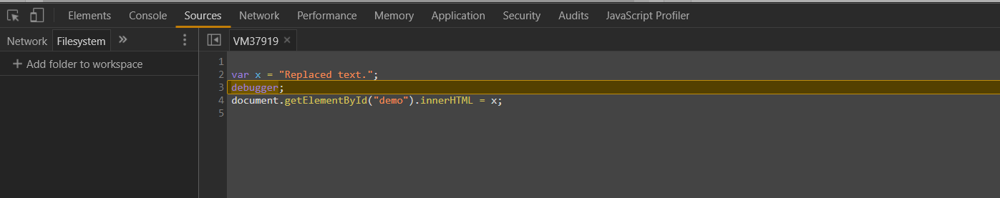
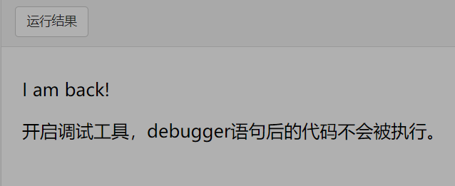

debugger
---
[Jsbin例子](https://jsbin.com/somirof/2/edit?html,js)

**DEBUG** 是一种计算机程序。马克2号（Harvard Mark II）编制程序的葛丽丝·霍波（Grace Hopper）是一位美国海军准将及计算机科学家，同时也是世界最早的一批程序设计师之一。有一天，她在调试设备时出现故障，拆开继电器后，发现有只飞蛾被夹扁在触点中间，从而“卡”住了机器的运行。于是，霍波诙谐的把程序故障统称为“臭虫（BUG）”，把排除程序故障叫DEBUG，这奇怪的“称呼”，成为了计算机领域的专业行话.

**debugger** 从字面意思上指排除程序故障用的装置。在Javascript里，**debugger语句** 就像是一个开关。

语法：

~~~javascipt
debugger;
~~~

**debugger 语句** 调用任何可用的调试功能，如设置断点。 如果没有调试功能启用，则该语句不起作用。

---
示例：
~~~html

I am back!

开启调试工具，debugger语句后的代码不会被执行。

~~~
~~~js
var x = "Replaced text";
debugger;
document.getElementById("demo").innerHTML = x;
~~~

可以看到正常情况下 **debugger 语句** 没有产生作用，所有代码运行。p tag里的文本被替换为 “Replaced text” .

当使用F12启动chrome 的调试工具后，代码停留在 **debugger** 处，后面的代码未被执行。

`p` 里的文本恢复原来的 “I am back!” .

---
参考：

>https://baike.baidu.com/item/DEBUG

>https://developer.mozilla.org/zh-CN/docs/Web/JavaScript/Reference/Statements/debugger
