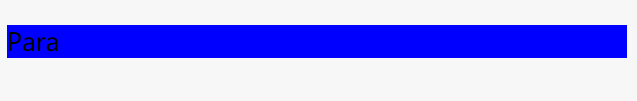
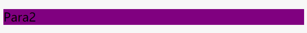
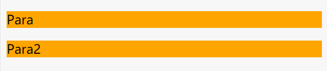

CSS Cascade 级联
---
[JSbin例子](https://jsbin.com/quhewem/edit?html,css,output "click me")

如果有两个或两个以上规则作用于一个元素，你要知道哪一规则最具有优先级。控制此优先级的机制就称为级联。
可以简单的理解为“冲突”的解决方案。

### 选择器的胜出取决于三个因素：

#### 1 源代码次序（Source order）

LAST RULE：
If multiple selectors are identical, the last of them will take precedence.

一个元素存在多个相同的选择器时，后者的优先级会更高。
~~~html5
<h1>Demo</h1>
~~~
~~~css
h1 {
    color: blue;
}
h1 {
    color: orange;
}
~~~
output:

可以看到字体颜色为后者的橙色。

#### 2	专用性（specificity）

**专用性** 基本上是衡量选择器的具体程度的一种方法——它能匹配多少元素。

一个选择器具有的专用性的量是用四种不同的值（或组件）来衡量的，它们可以被认为是千位，百位，十位和个位——在四个列中的四个简单数字：

1. 千位：如果声明是在style 属性中该列加1分（这样的声明没有选择器，所以它们的专用性总是1000。）否则为0。如`

`
2. 百位：每包含一个ID选择器加1分。
3. 十位：每包含一个类选择器、属性选择器、或者伪类加1分。
4. 个位：每包含一个元素选择器或伪元素加1分。

>**注意:** 通用选择器 ``(*)``, 复合选择器 ``(+, >, ~, ' ')`` 和否定伪类 ``(:not)`` 在专用性中无影响。

|选择器|	千位|	百位|	十位|	个位|	合计值|
| ----|------ | ---|---|--|---|
|h1|	0|	0	|0|	1|	0001|
|#important|	0	|1|	0|	0|	0100|
|h1 + p::first-letter|	0	|0|	0	|3|	0003|
|li > a[href*="zh-CN"] > .inline-warning|	0	|0|	2|	2|	0022|
|#important div > div > a:hover, 在一个元素的 ``<style> ``属性里	|1|	1	|1	|3	|1113|

example:
~~~html

Para

~~~
~~~css
p {
  background: orange;
} /* 0001 */

.demos {
  background: rgb(22,134,77);
} /* 0010 */

#p1 /* 0100 */{
  background: #354355;
} /* 0100 */

h1+#p1 {
  background: blue;
} /* 0101 */
~~~
output:

>随着 **选择器专用性** 逐渐增加，文本背景为蓝色。

>无论有多少类选择器都不会优先于单纯的ID选择器，因为专用性的衡量并不是我们误认为的10进制（base 10）。

再来一个例子，当一个元素有两个不同的类选择器，看看顺序是否会影响。
~~~html

Para2

~~~
~~~css
.first {
  background: red;
}
.second {
  background: purple;
}
~~~

>背景颜色还是被后者覆盖为紫色，说明专用性与元素内类选择器的顺序无关。

#### 3 重要性（Importance）
当在一个样式声明中使用一个`!important` 规则时，此声明将覆盖任何其他声明。

在专用性的例子中，给`p`选择器加上该语句，来覆盖其他声明。

~~~css
p {
  background: orange !important;
}
~~~

>由于 `!important` 改变了层叠正常工作的方式，因此调试CSS问题，尤其是在大型样式表中，会变得非常困难。因此还是尽量避免使用它。

---

参考

https://developer.mozilla.org/en-US/docs/Learn/CSS/Introduction_to_CSS/Cascade_and_inheritance

Book: HTML and CSS: Design And Build Websites

https://css-tricks.com/specifics-on-css-specificity/
