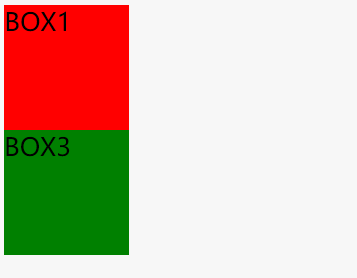
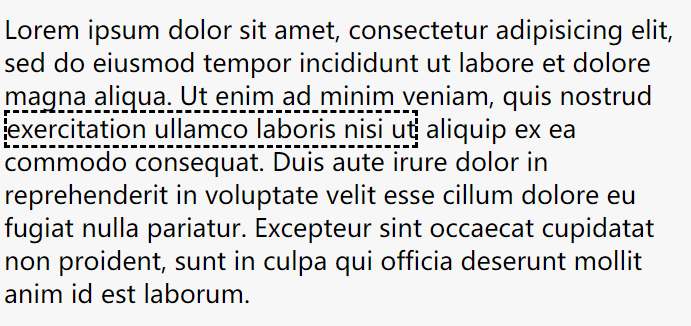
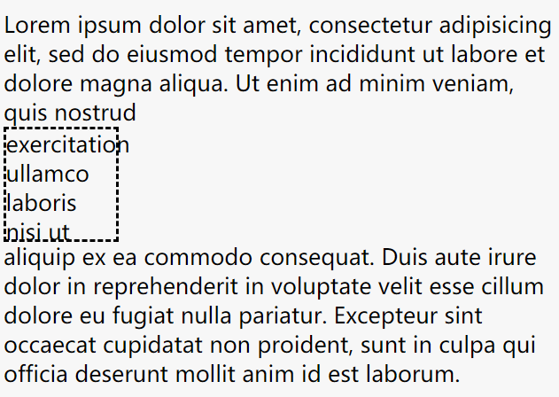
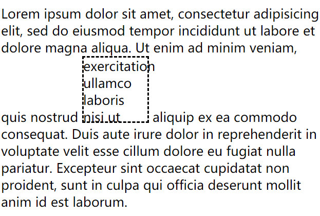
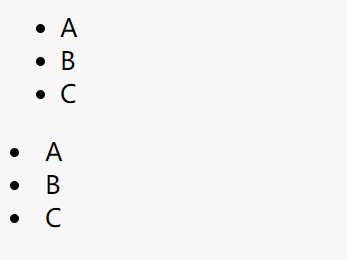
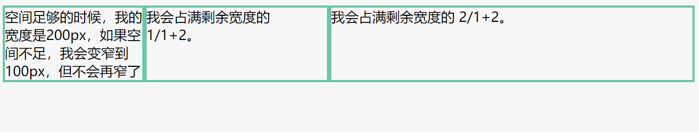

CSS display
---
以下为 **display** 的属性 。

~~~css
/* <display-outside> values */
display: block;
display: inline;
display: run-in;

/* <display-inside> values */
display: flow;
display: flow-root;
display: table;
display: flex;
display: grid;
display: ruby;
display: subgrid;

/* <display-outside> plus <display-inside> values */
display: block flow;
display: inline table;
display: flex run-in;

/* <display-listitem> values */
display: list-item;
display: list-item block;
display: list-item inline;
display: list-item flow;
display: list-item flow-root;
display: list-item block flow;
display: list-item block flow-root;
display: flow list-item block;

/* <display-internal> values */
display: table-row-group;
display: table-header-group;
display: table-footer-group;
display: table-row;
display: table-cell;
display: table-column-group;
display: table-column;
display: table-caption;
display: ruby-base;
display: ruby-text;
display: ruby-base-container;
display: ruby-text-container;

/* <display-box> values */
display: contents;
display: none;

/* <display-legacy> values */
display: inline-block;
display: inline-table;
display: inline-flex;
display: inline-grid;

/* Global values */
display: inherit;
display: initial;
display: unset;
~~~

* display 属性使用关键属性值指定。 关键属性值被分为六类：

 * `<display-outside>`
 * `<display-inside>`
 * `<display-listitem>`
 * `<display-internal>`
 * `<display-box>`
 * `<display-legacy>`

>目前最好使用单个关键词指定 display ；虽然最新规范允许组合关键词，但浏览器并没有很好地支持。

----

1.`display: none` 关闭一个元素的显示（对布局没有影响）；其所有后代元素都也被会被关闭显示。文档渲染时，该元素如同不存在。

~~~html

BOX1

BOX2

BOX3

~~~
~~~css
#box1{
  height:100px;
  width:100px;
  background:red;
}
#box2{
  display:none;
  height:100px;
  width:100px;
  background:blue;
}
#box3{
  height:100px;
  width:100px;
  background:green;
}
~~~

Output:

>BOX2  消失而不影响布局。

与`visible:hidden`的区别：
>`display:none`：不为被隐藏的对象保留其物理空间，即该对象在页面上彻底消失，通俗来说就是看不见也摸不到。  
`visible:hidden`：使对象在网页上不可见，但该对象在网页上所占的空间没有改变，通俗来说就是看不见但摸得到。

2.`display: inline`： 该元素生成一个或多个行内元素盒。

`display: block`：该元素生成一个块元素盒。

`display: inline-block`(CSS 2.1)：该元素生成一个块状盒，该块状盒随着周围内容流动，如同它是一个单独的行内盒子扩展值。

假如我们在``
``的一大串文字中,嵌入了一个````的文字, 通过设置不同display,将有以下效果:
~~~html
 
Lorem ipsum dolor sit amet, consectetur adipisicing elit, sed do eiusmod tempor incididunt ut labore et dolore magna aliqua. Ut enim ad minim veniam, quis nostrud exercitation ullamco laboris nisi ut aliquip ex ea commodo consequat. Duis aute irure dolor in reprehenderit in voluptate velit esse cillum dolore eu fugiat nulla pariatur. Excepteur sint occaecat cupidatat non proident, sunt in culpa qui officia deserunt mollit anim id est laborum.

~~~
~~~css
span{
  display: inline;
  height:100px;
  width:100px;
  border:2px dashed black;
}
~~~
>

>真正的inline元素的尺寸是浏览器自己计算决定的，这是渲染引擎的设定，`display: inline`无法设置`width`和`height`。

~~~css
 span{
  display: block;
  height:100px;
  width:100px;
  border:2px dashed black;
}
~~~
>

>`display: block` 生成了块元素并强制换行。

~~~css
span{
  height:100px;
  width:100px;
  display: inline-block;
  border:2px dashed black;
}
~~~
>

>`display:inline-block`不设置高度和宽度时和`display:inline`一样,也可以保持元素在同一行内渲染。

`display: list-item`：该元素生成一个容纳内容和单独的列表行内元素盒的块状盒。
~~~html
<ul>
  <li>A</li>
  <li>B</li>
  <li>C</li>
</ul>

 
A

 
B

 
C

~~~

~~~css
.list > div {
      display:list-item;
      list-style-type: disc;
      list-style-position: inside;
  }
}
~~~
`display:list-item` 加列表样式来模仿``<ul>``列表；

>

#### Flexbox模型值 (CSS3)
`display:flex` 定义一个元素为弹性布局，它所包含的子元素为块状元素。

`display:inline-flex` 定义一个元素为弹性布局，它所包含的子元素为行内元素。

下面是一个简单的例子：
[Jsbin](https://jsbin.com/somirof/3/edit?html,css,output)
~~~html

    空间足够的时候，我的宽度是200px，如果空间不足，我会变窄到100px，但不会再窄了
    我会占满剩余宽度的  1/1+2。
    我会占满剩余宽度的 2/1+2。

~~~
~~~css
#flex-container {
  display: flex;
}
#initial {
  width: 200px;
  min-width: 100px;
}
#flex1 {
  flex: 1;
}
#flex2 {
  flex: 2;
}
.elem{
  border: solid #6AC5AC 3px;
}
~~~

>

[See more details about flex box.](https://css-tricks.com/snippets/css/a-guide-to-flexbox/)

---

#### display表格模型值 (CSS 2.1)

|值|描述|
|----|--|
|`inline-table`	|inline-table值在HTML中没有对应元素。它的行为就像一个HTML中的table元素，但是作为内联框，而不是块级框。 表格框内是一个块级上下文。|
|`table`|	这个元素的作用就像 `` <table> ``元素. 它定义了一个块级盒子.|
|`table-caption`|	这个元素的作用的就像``<caption>`` 一样.|
|`table-cell`|	这个元素的作用就像``<td> ``一样。|
|`table-column`	|这个元素的作用就像``<col>`` 一样|
|`table-column-group`	|这个元素的作用就像``<colgroup>`` 一样。|
|`table-footer-group`	|这个元素的作用就像``<tfoot>`` 一样.|
|`table-header-group`|	这个元素的作用就像``<thead> ``一样|
|`table-row`	|这个元素的作用就像``<tr>`` 一样.|
|`table-row-group`|这个元素的作用就像``<tbody>`` 一样。|

---
其他属性是实验性质的，支持度都很低，不建议使用，知道就行。

https://developer.mozilla.org/en-US/docs/Web/CSS/display
