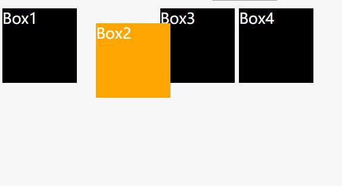
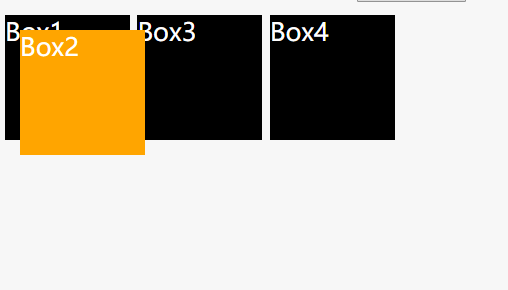
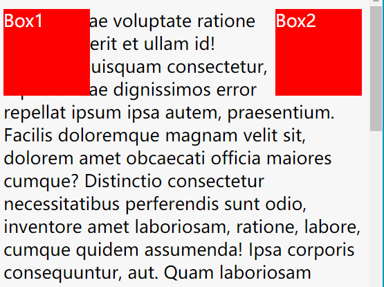
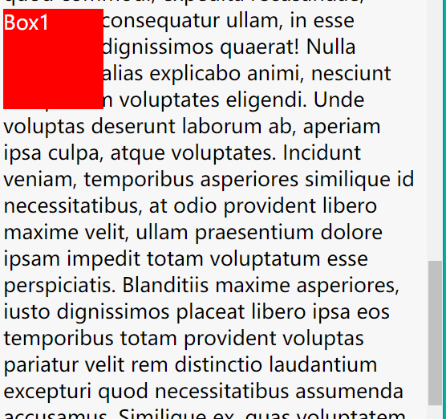
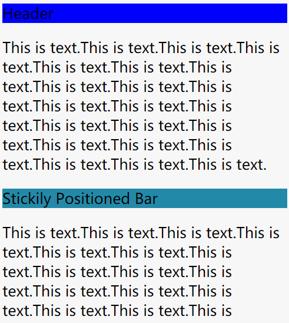
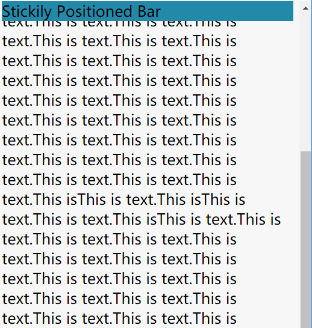

css position
---

#### 定位类型
**定位元素（positioned element）** 是其计算后位置属性为 `relative`, `absolute`, `fixed` 或 `sticky` 的一个元素。

**相对定位元素（relatively positioned element）** 是计算后位置属性为 `relative` 的元素。

**绝对定位元素（absolutely positioned element）** 是计算后位置属性为 `absolute` 或 `fixed` 的元素。

**粘性定位元素（stickily positioned element）** 是计算后位置属性为 `sticky` 的元素。

#### 值
##### `static`

指定元素使用正常的布局行为，即元素在文档常规流中当前的布局位置。此时 `top`, `right`, `bottom`, `left` 和 `z-index`属性无效。

##### `relative` [Jsbin](https://jsbin.com/vageqi/1/edit?html,css,output)

元素在文档常规流中预留当前的布局位置，类似`static`。但此时 `top`, `right`, `bottom`, `left` 和 `z-index`属性会起作用。位置属性会以元素的预留位置为原点进行移动。
~~~html

Box1

Box2

Box3

Box4

~~~
~~~css
.box {
  display: inline-block;
  width: 100px;
  height: 100px;
  background: black;
  color: white;
}

#two {
  position: relative;
  top: 20px;
  left: 20px;
  background: orange;
}
~~~

Output:

>

> 可以看到Bos2以在文档中的预留位置为基准，向下向左移动20px.

##### `absolute` [Jsbin](https://jsbin.com/vageqi/1/edit?html,css,output)

文档常规流中移除该元素，不为元素预留空间，其他文档常规流的元素会表现得如同此元素不存在一般，位置属性仍会起作用。通过指定元素相对于最近的非 `static` 定位祖先元素的偏移，来确定元素位置。绝对定位的元素可以设置外边距（margins），且不会与其他边距合并。
~~~css
#two {
  position: absolute;
}
~~~
Output:
>

将`relative`例子中Box2的`position`改为`absolute`后，可以看到Box2从文档常规流被移除，预留空间消失。相对于最近的非`` static` 定位祖先元素(此处为``<body>``)进行向下向左的偏移。  

##### `fixed` [Jsbin](https://jsbin.com/falujap/edit?html,css,output)

文档常规流中移除该元素，不为元素预留空间，几乎像`absolute`值一样。而是通过指定元素相对于屏幕视口（viewport）的位置来指定元素位置而不是特定的父元素。元素的位置在屏幕滚动时不会改变。

~~~html
   
Box1

   
Box2

   
大段文字

~~~
~~~css
.box {
  display: inline-block;
  width: 100px;
  height: 100px;
  background: red;
  color: white;
}
#left{
  float:left;
  position: fixed;
}

#right{
  float:right;
}
~~~

>

>

Box1和Box2是两个依附两端的浮动元素，唯一区别就是Box1的`position: fixed`.可以看到，随这屏幕滚动，Box1仍然固定在相同位置。

##### `sticky`(实验性参数) [Jsbin](https://jsbin.com/najamah/edit?html,css,output)

`sticky`值像是`relative`与`fixed`的折中产物。一开始该元素在文档常规流中预留当前的布局位置，直到屏幕滚动到视口的某一临界值时开始固定。

~~~html
    <header>Header</header>
    
大段文字

    
Stickily Positioned Bar

    
大段文字

~~~
~~~css
header {
  background:blue;
}
div {
  position: sticky;
  top: 0px;
  background:#2389a8;
}
~~~
初始位置：
>

屏幕滚动过`Stickily Positioned Bar`后，此元素固定在离视窗顶端距离 0px 处，即为顶端。
>

---
参考：

>https://developer.mozilla.org/en-US/docs/Web/CSS/position

>https://css-tricks.com/almanac/properties/p/position/
