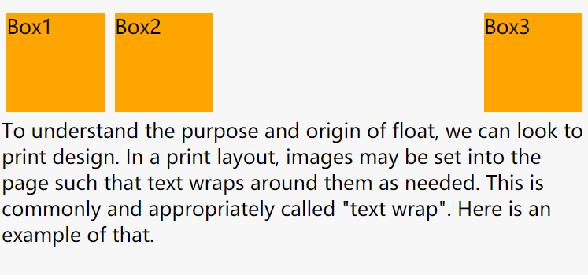

CSS float
---

float 属性定义元素在哪个方向浮动。以往这个属性总应用于图像，使文本围绕在图像周围，不过在 CSS 中，任何元素都可以浮动。

~~~
/* Keyword values */
float: left;
float: right;
float: none;
/*实验性值，避免使用*/
float: inline-start;
float: inline-end;

/* Global values */
float: inherit;
float: initial;
float: unset;
~~~

#### 值：

`none`: 表明元素不进行浮动，为初始值.

`left`: 表明元素必须浮动在其所在的块容器左侧.

`right`: 表明元素必须浮动在其所在的块容器右侧的关键字。

`inherit`: 表明元素继承父元素的浮动方向.

Note: 浮动元素会生成一个块级框，而不论它本身是何种元素。

#### 浮动元素的定位：

当一个元素浮动之后，它会被移出正常的文档流，然后向左或者向右平移，一直平移直到碰到了所处的容器的边框，或者碰到另外一个**浮动的元素**。

例子:
~~~html
Box1
Box2
Box3

To understand the purpose and origin of float, we can look to print design. In a print layout, images may be set into the page such that text wraps around them as needed. This is commonly and appropriately called "text wrap". Here is an example of that.

~~~
~~~css
span {
  width:100px;
  height:100px;
  margin: 5px;
  background: orange;
}

.left{
  float:left;
}

.right{
  float:right;
}
~~~

Output:

>

给``
``元素加上清除浮动后，它会将非浮动块的边框边界移动到所有相关浮动元素外边界的下方。

~~~css
p {
 clear: both;
}
~~~

>

参考：

>https://developer.mozilla.org/zh-CN/docs/CSS/float

>https://css-tricks.com/almanac/properties/f/float/
