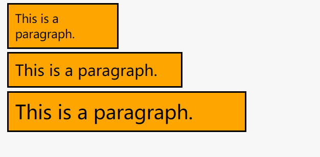
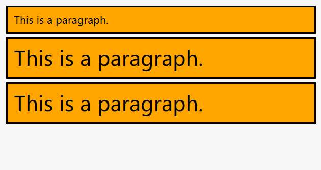
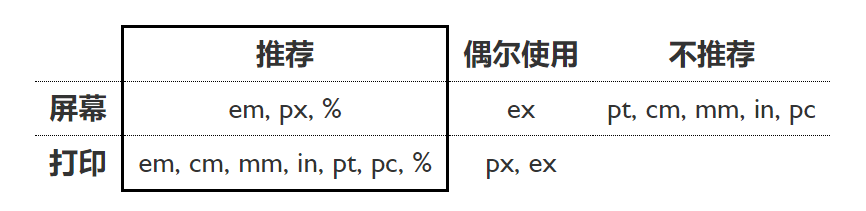
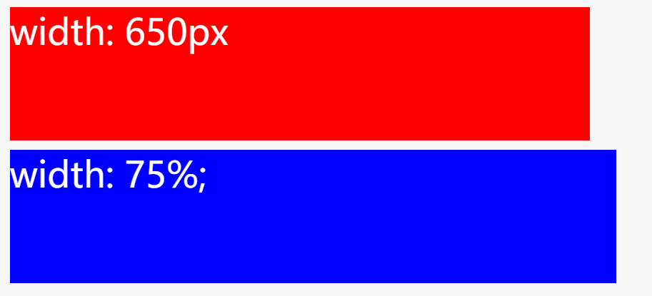
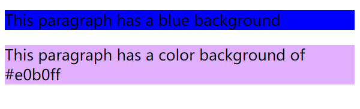
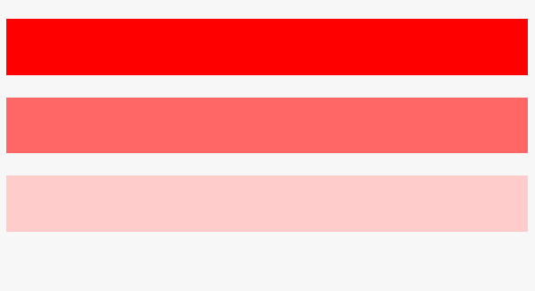
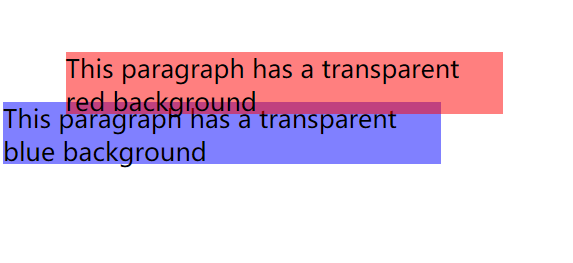
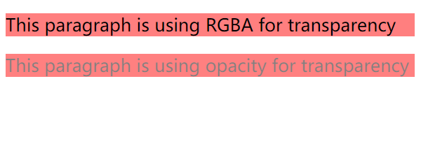

CSS 度量衡及工作原理
---
CSS的属性值可以有很多种类，可以是普通类型的数值，也可以是有特定作用的颜色和函数（比如内置的背景图片，或者旋转一个元素）。有些值通过特定的单位来指定与之相对应的值.

**数值**: 长度值，用于指定例如元素宽度、边框（border）宽度或字体大小；以及无单位整数。用于指定例如相对线宽或运行动画的次数。

**百分比**: 可以用于指定尺寸或长度——例如取决于父容器的长度或高度，或默认的字体大小。

**颜色**: 用于指定背景颜色，字体颜色等。

**坐标位置**: 例如，以屏幕的左上角为坐标原点定位元素的位置。

**函数**: 例如，用于指定背景图片或背景图片渐变。

 ---

#### 1.数值

##### 绝对长度单位
因为无论其他相关的设置怎么变化，像素指定的值是不会变化的。

>**除了px之外，你很可能都不怎么使用其他的单位。**

|Unit	|Description|
|-|-|
|cm|	centimeters|
|mm|	millimeters|
|in|	inches (1in = 96px = 2.54cm)|
|px *|	pixels (1px = 1/96th of 1in)|
|pt|	points (1pt = 1/72 of 1in)|
|pc|	picas (1pc = 12 pt)|

一个简单的例子——先上HTML：
~~~html

This is a paragraph.

This is a paragraph.

This is a paragraph.

~~~
~~~css
p {
  margin: 5px;
  padding: 10px;
  border: 2px solid black;
  background-color: orange;
}

p:nth-child(1) {
  width: 150px;
  font-size: 18px;
}

p:nth-child(2) {
  width: 250px;
  font-size: 24px;
}

p:nth-child(3) {
  width: 350px;
  font-size: 30px;
}
~~~
>

* 分别将每个段落的 `margin`，`padding` 和 `border-width` 设置为5 pixels, 10 pixels 和 2 pixels。一个单独的`margin`/`padding`值表示所有的4个面都被设置成同样的值。边框也被设置成了` border` 的缩写值。

* 为三个不同的段落设置越来越大的宽度（`width `）像素值，也就是意味着越往下盒子越大。

* 为三个不同的段落设置越来越大字号（ `font-size`）像素值，也就是意味着越往下文本越大。`font-size`代表字体/字形的高度。

##### 相对长度单位

他们是相对于当前元素的字号（ `font-size` ）或者视口（`viewport`）尺寸。

`em`:`1em`与当前元素的字体大小相同（更具体地说，一个大写字母M的宽度）。CSS样式被应用之前，浏览器给网页设置的默认基础字体大小是16像素，这意味着对一个元素来说1em的计算值默认为16像素。但是要小心—em单位是会继承父元素的字体大小。**em是Web开发中最常用的相对单位**.

`ex`, `ch`: 分别是小写x的高度和数字0的宽度。这些并不像em那样被普遍使用或很好地被支持。

`rem`: `rem`(`em`的"根(root)")是文件的根元素的字体大小。它和`em`以同样的方式工作，但它总是等于默认基础字体大小的尺寸；继承的字体大小将不起作用，所以这听起来像一个比`em`更好的选择，虽然在旧版本的IE上不被支持。

`vw`, `vh`: 分别是视口宽度的1/100和视口高度的1/100，其次，它不像rem那样被广泛支持。
使用相对单位是非常有用的-你可以调整你的HTML元素大小相对于你的字体或视口大小.

`vmin` and `vmax`: 分别取`vw`and`vh`二者的最小值和最大值。

~~~css
body {
  font-size:16px;
}

p {
  font-size:16px;
  margin: 5px;
  padding: 10px;
  border: 2px solid black;
  background-color: orange;
}

p:nth-child(1) {
  font-size: 1em;
}

p:nth-child(2) {
  font-size: 2em;
}

p:nth-child(3) {
  font-size: 32px;
}
~~~
Output:
>
第二个段落的`font-size`为2*父元素的`16px`和第三个段落的`32px`一致.

一般来说，你会使用不同的单位来在屏幕上显示或在纸上打印。以下表格提供了推荐的用法:
>

---

#### 无单位的值
你有时候会在CSS遇到无单位的数值，这不总是一个错误，事实上它是在某些情况下，完全可以。例如，如果你想让一个元素完全去除外边距，你可以只使用无单位的0。

~~~css
elem {margin: 0;}
~~~

无单位的行高

另一个例子是 line-height,设置元素中每行文本的高度。你可以使用单位设置特定的行的高度，但使用一个无量纲的值往往更容易，它就像一个简单的乘法因子。例如：
~~~html

Blue ocean silo royal baby space glocal evergreen relationship housekeeping
native advertising diversify ideation session. Soup-to-nuts herding cats resolutionary
virtuoso granularity catalyst wow factor loop back brainstorm. Core competency
baked in push back silo irrational exuberance circle back roll-up.

~~~
~~~CSS
p {
  font-size:16px;
  line-height: 1.5;
}
~~~

这里的font-size的值为16px; 行高为1.5或24px。

---

#### 动画的数值
CSS动画能够让页面上的HTML元素动起来。我们来看一个例子，当我们把鼠标浮动到一个段落上的时候，它能够旋转起来。
~~~css
@keyframes rotate {
  0% {
    transform: rotate(0deg);
  }

  100% {
    transform: rotate(360deg);
  }
}

p {
  background: red;
  width: 100px;
  height:100px;
}

p:hover {
  animation-name: rotate;
  animation-duration: 0.6s ;
  animation-timing-function: linear;
  animation-iteration-count: infinite;
}
~~~
Jsbin: https://jsbin.com/nufabiw/edit?html,css,output

这里你可可以看到一些我们我们之前没有明确提到的有趣单位 (`<angle>s`、 `<time>s`、 ``<timing-function>``、 `<string>s`...)，这一行 animation-iteration-count: infinite.使得`p`元素一直旋转。

---

#### 百分比

使用百分比值指定可以通过特定数值指定的大部分内容。这使我们可以创建，例如，其宽度总是会移动到其父容器宽度的一定百分比的框中。这可以与那些将其宽度设置为某个单位值（如px或ems）的框进行比较，它们的长度总是保持相同的长度，即使它们的父容器的宽度发生变化。

举个例子：
~~~html

  
width: 650px

  
width: 75%;

~~~
~~~css
div .boxes {
  margin: 10px;
  font-size: 200%;
  color: white;
  height: 150px;
}

.boxes:nth-child(1) {
  background-color: red;
  width: 650px;
}

.boxes:nth-child(2) {
  background-color: blue;
  width: 75%;
}
~~~
这给了我们以下结果：

>

Jsbin: https://jsbin.com/sanasoy/edit?html,css,output

第一个div始终具有相同的宽度，即使视口大小被调整（当视口变得比屏幕更窄时，它将从屏幕上消失），而第二个div的宽度随着视口（viewport ）的变化而变化，使其始终保持其父元素的75％。 在这个例子中，div的父元素是``<body>``元素，默认情况下是视口宽度的100％。

这种框布局类型通常称为动态（流体）布局（如浏览器视口大小的变化），固定宽度布局（不管怎样都保持不变）：

---

#### 颜色
CSS中指定颜色的方法有很多，其中一些是最近实现的。CSS中到处都可以使用相同的颜色值，无论是指定文本颜色、背景颜色，还是其他任何颜色。

现代计算机中可用的标准颜色系统是24位，通过不同的红、绿、蓝通道，每个通道有256种不同的值，从而显示出大约1670万种不同的颜色。  (256 x 256 x 256 = 16,777,216.)

##### 关键词
最简单、最古老的颜色类型在CSS颜色关键词。这些都是特定的字符串代表特定的颜色值。例如,下面的代码:

~~~css
p {
  background-color: red;
}
~~~

它只能让我们指定明显的颜色基元。有大约165个不同的关键字可用于现代Web浏览器.

##### 十六进制值
十六进制代码。每个颜色包括一个哈希/磅符号（#）和其后面紧跟的六个十六进制数，其中每个十六进制数可以是0和F之间的一个值（一共16个），0123456789abcdef。每对十六进制数代表一个通道（红色、绿色或者蓝色）允许我们指定256个可用值。 (16 x 16 = 256.)  

例如，这个代码：

This paragraph has a blue background

This paragraph has a pinky lilac background

~~~css
/* equivalent to the blue keyword */
p:nth-child(1) {
  background-color: #0000ff;
}

/* has no exact keyword equivalent */
p:nth-child(2) {
  background-color: #e0b0ff;
}
~~~
给出以下结果：
>

这些值比较复杂，不太容易理解，但是它们比关键字更灵活——您可以使用十六进制值来表示您想要在颜色方案中使用的任何颜色。

##### RGB
RGB值是一个函数rgb() -这是给定的三个参数表示的红色，绿色和蓝色通道的颜色值，在大致相同的方式作为十六进制值。与RGB的区别在于，每个通道不是由两个十六进制数字表示的，而是由0到255之间的十进制数表示的。RGB值更直观，更容易理解。

让我们重写最后一个例子来使用RGB颜色：
~~~css
/* equivalent to the blue keyword */
p:nth-child(1) {
  background-color: rgb(0,0,255);
}

/* has no exact keyword equivalent */
p:nth-child(2) {
  background-color: rgb(224,176,255);
}
~~~

RGB值的支持度与十六进制不相上下，在你的工作中你可能不会遇到任何不支持它们的浏览器。

>Note: 为什么是255而不是256？计算机系统倾向于从0计算，而不是从1计算。所以允许256个可能的值，RGB颜色在0-255范围值，不是1-256。

##### HSL
支持度比RGB稍微差一点的是HSL（不支持旧版本IE），这是开发者非常感兴趣而实施的——不只是红、绿和蓝色的值，该hsl()函数接受的色相、饱和度以及明度值，以与上述三种不同的方式用来区分167万种颜色：

**色调**： 颜色的底色调。这个值在0到360之间，表示色轮周围的角度。

**饱和度** ：饱和度是多少？这需要一个从0-100%的值，其中0是没有颜色（它将显示为灰色），100%是全彩色饱和度。

**明度**：颜色有多亮或明亮？这需要一个从0-100%的值，其中0是无光（它会出现全黑的），100%是充满光的（它会出现全白）。

现在我们用HSL颜色重写例子:
~~~css
/* equivalent to the blue keyword */
p:nth-child(1) {
  background-color: hsl(240,100%,50%);
}

/* has no exact keyword equivalent */
p:nth-child(2) {
  background-color: hsl(276,100%,85%);
}
~~~

HSL颜色模型对于常使用这样的模型的设计师来说非常直观。例如,找到一组色调以单配色方式使用是非常有用的。

/* three different shades of red*/
~~~css
p{
  height: 50px;
}
p:nth-child(1){
background: hsl(0,100%,50%)
}
p:nth-child(2){
background: hsl(0,100%,70%);
}
p:nth-child(3){
background: hsl(0,100%,90%);
}
~~~
>

##### RGBA 和 HSLA
RGB和HSL都有相应的模式——RGBA和HSLA——不仅允许您设置想要显示的颜色,还有此颜色的透明度（ `transparency` ）。它们与与之相应的函数采用同样的参数,再加上第四个范围在0-1的值——设置透明度,或者说`alpha通道``。0是完全透明的,1是完全不透明的。

例如：

~~~html

This paragraph has a transparent red background

This paragraph has a transparent blue background

~~~

~~~css
p {
  height: 50px;
  width: 350px;
}
/* Transparent red */
p:nth-child(1) {
  background-color: rgba(255,0,0,0.5);
  position: relative;
  top: 30px;
  left: 50px;
}
/* Transparent blue */
p:nth-child(2) {
  background-color: hsla(240,100%,50%,0.5);
}
~~~

结果如下：
>

##### 不透明度（Opacity）

还有另一种方法来指定透明度，通过CSS——opacity 属性。与设置某个特定颜色的透明度相比，这会设置所有选定元素以及它们的孩子节点的不透明度。为了看出他们的区别，我们来研究下面这个例子：
~~~html

This paragraph is using RGBA for transparency

This paragraph is using opacity for transparency

~~~
~~~css
/* Red with RGBA */
p:nth-child(1) {
  background-color: rgba(255,0,0,0.5);
}

/* Red with opacity */
p:nth-child(2) {
  background-color: rgb(255,0,0);
  opacity: 0.5;
}
~~~
结果如下：
>

区别——第一个盒子使用RGBA颜色，只有一个半透明的背景,而一切在第二个盒子里的都是透明的,包括文本。

---

#### 函数

在程序中，`functions`是代码中的可重复使用的部分，它可以多次运行，以便使开发人员和计算机以最小的代价完成重复的任务。它也作为属性值存在于CSS中。我们已经在Colors部分中看到函数了，例如 `rgb()`, `hsl()`：

background-color: rgba(255,0,0,0.5);
background-color: hsla(240,100%,50%,0.5);
这些函数计算使用什么颜色。

其他地方也会看到函数——每当你看到一个名字后跟着括号,括号里包含用逗号分隔的一个或多个值,那么你所使用的就是一个函数。例如上面动画的例子中:
~~~css
@keyframes rotate {
  0% {
    transform: rotate(0deg);
  }

  100% {
    transform: rotate(360deg);
  }
}
~~~
用关键帧对动画的开头帧和结束帧的定义就是函数。将结束帧设为`-360deg`时，元素会行逆时针旋转。

---

参考：

>https://developer.mozilla.org/en-US/docs/Learn/CSS/Introduction_to_CSS/Values_and_units
>https://www.w3.org/Style/Examples/007/units.zh_CN.html
