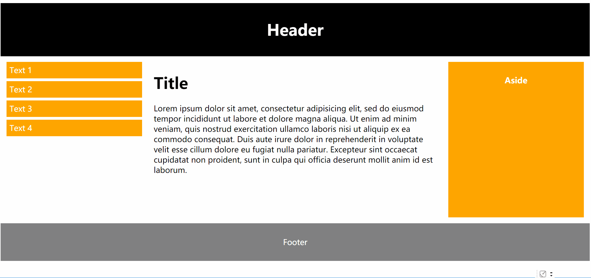

CSS Media Query
---
**媒体查询（Media Query**：由一个可选的媒体类型和零个或多个使用媒体功能的限制了样式表范围的表达式组成，例如宽度、高度和颜色。媒体查询，添加自CSS3，允许内容的呈现针对一个特定范围的输出设备而进行裁剪，而不必改变内容本身。

~~~css
@media (max-width: 600px) {
  .facet_sidebar {
    display: none;
  }
}
~~~
``@media` 后面圆括号里的是媒体特征，亦可添加其他媒介类型。当媒体查询为true时，其对应的样式表或样式规则就会遵循正常的级联规则进行应用。

你可以使用逻辑操作符，包括`not`、`and`和`only`等，加上逗号分隔列表来构建复杂的媒体查询。

~~~css
在最小宽度是700像素或者是横屏手持设备的上应用样式。
@media (min-width: 700px), handheld and (orientation: landscape) { ... }
~~~

Example: （https://jsbin.com/kisanoh/2/edit?html,css,output）
~~~html5

  <h1>Header</h1>

  <ul>
    <li>Text 1</li>
    <li>Text 2</li>
    <li>Text 3</li>
    <li>Text 4</li>
  </ul>

  <h1>Title</h1>
  
Chania is the capital of the Chania region on the island of Crete. The city can be divided in two parts, the old town and the modern city.

  

    <h2>Aside</h2>
  

  
Footer

~~~
~~~css
* {
    box-sizing: border-box;
}
/*元素的内边距和边框不再会增加它的宽度*/

.row::after {
    content: "";
    clear: both;
    display: block;
}
/*clear: both 元素被向下移动用于清除之前的左右浮动*/
/*display:block 该元素生成一个块元素盒*/

[class*="col-"] {
    float: left;
    padding: 15px;
}
.header {
    background-color: black;
    color: #ffffff;
    padding: 15px;
    text-align: center;
}
.menu ul {
    list-style-type: none;
    margin: 0;
    padding: 0;
}
.menu li {
    padding: 8px;
    margin-bottom: 7px;
    background-color: orange;
    color: #ffffff;
}
.aside {
    background-color: orange;
    padding: 15px;
    color: #ffffff;
    text-align: center;
    font-size: 14px;
    height: 400px;
}
.footer {
    background-color: grey;
    color: #ffffff;
    text-align: center;
    padding: 15px;
}

.col-3 {width: 25%;}
.col-6 {width: 50%;}
.col-12 {width: 100%;}

@media only screen and (max-width: 600px) {
    [class*="col-"] {
        width: 100%;
    }

    .aside {
        height: auto;
    }
~~~
Output:
>利用媒体查询的一个根据视窗最大宽度来改变布局的例子。
>
---

#### 媒介类型：
* print：用于打印机和打印预览
*	screen：用于电脑屏幕，平板电脑，智能手机等
*	all：用于所有媒体设备类型

#### 媒体特征

**颜色（color)** ：指定输出设备每个像素单元的比特值。如果设备不支持输出颜色，则该值为0。

**颜色索引（color-index)** :指定了输出设备中颜色查询表中的条目数量。

**宽高比（aspect-ratio）**：描述了输出设备目标显示区域的宽高比。

**设备宽高比（device-aspect-ratio）**：描述了输出设备的宽高比。该值包含两个以“/”分隔的正整数。

**设备高度（device-height）**：描述了输出设备的高度（整个屏幕或页的高度，而不是仅仅像文档窗口一样的渲染区域）。

**设备宽度（device-width）**：描述了输出设备的宽度（整个屏幕或页的高度，而不是仅仅像文档窗口一样的渲染区域）。

**网格（grid）**：判断输出设备是网格设备还是位图设备。如果设备是基于网格的（例如电传打字机终端或只能显示一种字形的电话），该值为1，否则为0。

**宽度（width)** ：描述了输出设备渲染区域（如可视区域的宽度或打印机纸盒的宽度）的宽度。

**高度（height)** ：描述了输出设备渲染区域（如可视区域的高度或打印机纸盒的高度）的高度。

**黑白（monochrome）**：指定了一个黑白（灰度）设备每个像素的比特数。如果不是黑白设备，值为0。

**方向（orientation）**：指定了设备处于横屏（宽度大于高度）模式还是竖屏（高度大于宽度）模式。

**分辨率（resolution）**：指定输出设备的分辨率（像素密度）。分辨率可以用每英寸（dpi）或每厘米（dpcm）的点数来表示。

**扫描（scan）**：描述了电视输出设备的扫描过程。
